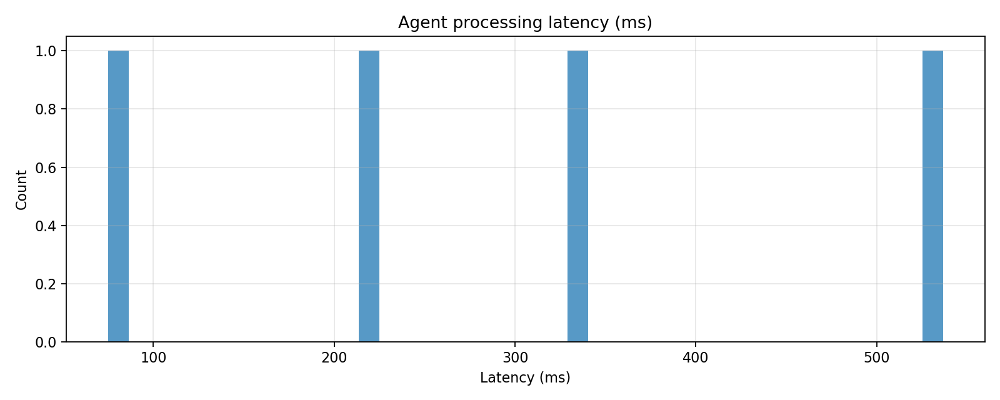
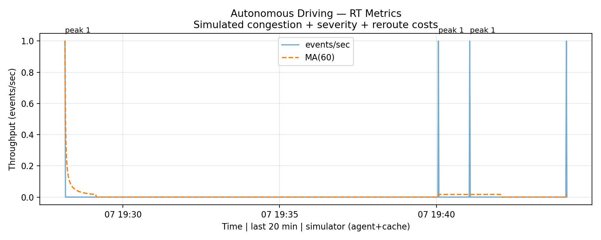
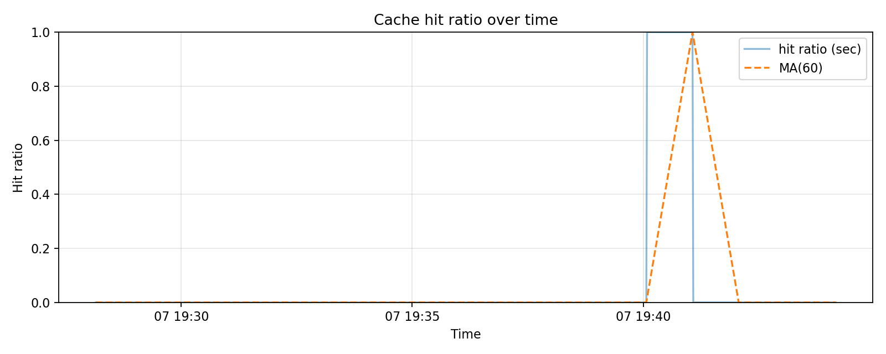
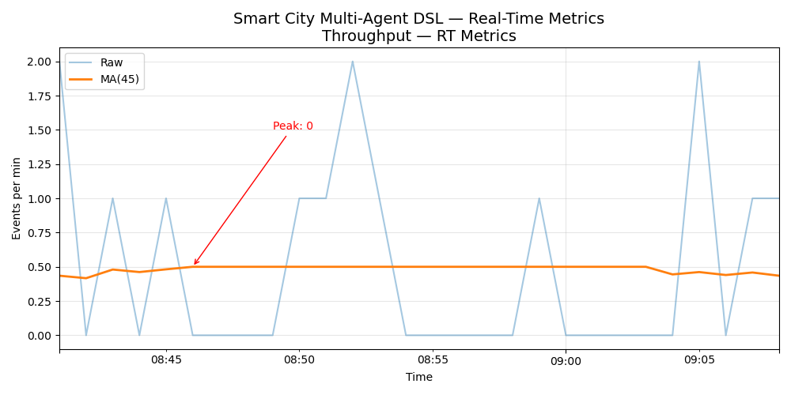

# Multi-Agent DSL Framework

This project introduces a novel framework using a Domain-Specific Language (DSL) to orchestrate multiple intelligent agents for complex, real-time event processing. The system is demonstrated through two key use cases: Smart City management and Autonomous Driving coordination.

## Core Value & Innovation

The core problem this project addresses is how to efficiently and intelligently handle complex, dynamic, and high-concurrency real-world events. The innovative solution is a multi-agent system built upon a Domain-Specific Language (DSL).

- **DSL (Domain-Specific Language)**: Allows for the definition of complex business logic and workflows in a clear, declarative manner. This abstraction simplifies the development and maintenance of the system, making it easier to modify and extend. The DSL is designed to be intuitive and expressive, enabling domain experts to define complex behaviors without deep programming knowledge.

- **Multi-Agent Architecture**: Decomposes complex tasks into specialized, independent agents that work collaboratively, achieving high modularity, scalability, and robustness. Each agent is a self-contained unit with a specific role, such as monitoring traffic, managing incidents, or ensuring safety. This separation of concerns makes the system more resilient to failures and easier to debug.

- **Real-time Feedback Loop**: Through WebSockets and a frontend UI, the system not only executes tasks but also monitors and visualizes the entire process in real-time, forming a complete "sense-decide-act-feedback" loop. This provides immediate insights into the system's state and performance, enabling rapid response to changing conditions.

## Practical Applications

The framework's ability to manage complex, real-time scenarios makes it suitable for a wide range of applications:

- **Smart City Management**:
    - **Traffic Optimization**: Dynamically adjust traffic signals and reroute vehicles based on real-time traffic conditions to reduce congestion.
    - **Public Safety**: Coordinate emergency services (police, fire, ambulance) in response to incidents.
    - **Resource Management**: Optimize the allocation of public resources, such as sanitation services and public transportation.

- **Autonomous Vehicle Coordination**:
    - **Fleet Management**: Coordinate the movements of a fleet of autonomous vehicles to optimize delivery routes and schedules.
    - **Collision Avoidance**: Enable vehicles to communicate and collaborate to avoid collisions in complex traffic situations.
    - **Ride-Sharing Services**: Dynamically match passengers with autonomous vehicles to provide efficient and convenient transportation.

- **Dynamic Resource Allocation**:
    - **Energy Grids**: Manage the distribution of energy in a smart grid to balance supply and demand.
    - **Supply Chain Logistics**: Optimize the flow of goods in a supply chain by dynamically rerouting shipments in response to disruptions.
    - **Cloud Computing**: Allocate computing resources in a data center to meet the demands of various applications.

## Running Experiments Locally

To run the experiments and see the system in action on your local machine, follow these steps:

### 1. Prerequisites

- **Node.js and npm**: Required for running the frontend.
- **Python 3.8+**: Required for running the backend and simulation scripts.

### 2. Installation

Clone the repository and install the required dependencies:

```bash
git clone https://github.com/your-username/multi-agent-dsl-final.git
cd multi-agent-dsl-final

# Install backend dependencies
pip install -r requirements.txt

# Install frontend dependencies
cd frontend
npm install
cd ..
```

### 3. Running the System

You will need to run the backend and frontend servers in separate terminals.

**Terminal 1: Start the Backend**

```bash
uvicorn backend.main:app --reload
```

This will start the backend server on `http://localhost:8000`.

**Terminal 2: Start the Frontend**

```bash
cd frontend
npm start
```

This will start the frontend development server and open the application in your default browser at `http://localhost:3000`.

### 4. Running an Experiment

Once the backend and frontend are running, you can run an experiment by sending events to the system.

**Terminal 3: Send Events**

You can use the `scripts/send_events.py` script to send events to the backend. Here are a few examples:

- **Send a traffic incident event:**
  ```bash
  python scripts/send_events.py --file traffic_incident_event.csv --api http://localhost:8000/events/traffic_incident
  ```

- **Trigger a weather alert:**
  ```bash
  python scripts/send_events.py --file weather_alert_event.csv --api http://localhost:8000/events/weather_alert
  ```

This script will read events from the specified CSV file and send them to the backend API. You can observe the system's response in real-time on the frontend.

## System Architecture & Key Components

The system is comprised of four key components:

1.  **Backend**: The brain and central nervous system of the system.
    -   **Technology**: Python, FastAPI, Uvicorn
    -   **Functionality**:
        -   **Event Ingestion**: The backend exposes a set of RESTful API endpoints (defined in `backend/api_routes.py`) for ingesting external events. Each event type has a dedicated endpoint (e.g., `/events/traffic_incident`, `/events/weather_alert`).
        -   **DSL Parsing and Execution**: Upon receiving an event, the backend triggers a corresponding DSL workflow (defined in `backend/dsl_workflows.py`). The DSL parser interprets the workflow and orchestrates the execution of tasks by the agent team.
        -   **Agent Management**: The backend manages the lifecycle of the agents, including their creation, scheduling, and communication. It uses a dependency injection system (see `backend/dependencies.py`) to provide agent instances to the API routes.
        -   **State Management**: The backend maintains the global state of the system, including the status of all agents and events.
        -   **Real-time Communication**: The backend uses a WebSocket manager (defined in `backend/websocket_manager.py`) to broadcast system status and results in real-time to the frontend, ensuring that the UI is always up-to-date. The main WebSocket endpoint is defined in `backend/main.py`.

2.  **Frontend**: The face and interactive window of the system.
    -   **Technology**: React, JavaScript
    -   **Functionality**:
        -   **Interactive Visualization**: Provides a map-based interface to visualize the system's state.
        -   **User Interaction**: Allows users to manually trigger events.
        -   **Real-time Updates**: Receives WebSocket messages to update the UI in real-time.

3.  **Agents**: The hands and feet of the system; the executors of specific tasks.
    -   **Technology**: Python
    -   **Functionality**: Each agent has a clear responsibility and expertise. The agents are defined in the `agents/` directory.

4.  **DSL (Domain-Specific Language)**: The "script" or "battle plan" of the system.
    -   **Technology**: Custom scripts based on Python, with the core logic in `dsl/dsl.py`.
    -   **Functionality**: Defines how the system should respond to different events.

### Agent Interaction Model

Agents in the system are designed to be autonomous and collaborative. They interact with each other through a combination of direct communication and shared state.

- **Event Bus**: The primary mechanism for inter-agent communication is the event bus. Agents can publish events to the bus and subscribe to events that are relevant to them. This allows for a loosely coupled architecture where agents can interact without having direct knowledge of each other.

- **Shared State**: Agents can also share information through a shared state mechanism, which is managed by the backend. This allows agents to access a consistent view of the system's state and coordinate their actions accordingly.

- **DSL-Orchestrated Collaboration**: The DSL plays a crucial role in orchestrating the collaboration between agents. A DSL script can define a workflow that involves multiple agents, specifying the sequence of tasks and the dependencies between them. For example, the `traffic_incident_workflow_task` in `backend/dsl_workflows.py` is triggered by the `/events/traffic_incident` API endpoint and orchestrates the `TrafficIncidentAgent` and other agents to handle the incident.

### DSL Primitives

The DSL provides a set of primitives for defining agent workflows. Here are the core primitives and how to use them:

- **`gen(name, prompt, agent)`**: This primitive is used to generate a new task for an agent.
    - `name`: A unique name for the task.
    - `prompt`: The prompt or instruction for the agent.
    - `agent`: The name of the agent that should execute the task.

    **Example:**
    ```python
    dsl.gen("task1", prompt="Analyze traffic data", agent="TrafficManagerAgent").schedule()
    ```

- **`join(tasks, mode)`**: This primitive is used to wait for a set of tasks to complete.
    - `tasks`: A list of tasks to wait for.
    - `mode`: The waiting mode. Can be "all" (wait for all tasks to complete) or "any" (wait for any one task to complete).

    **Example:**
    ```python
    task1 = dsl.gen("task1", prompt="Task 1", agent="Agent1").schedule()
    task2 = dsl.gen("task2", prompt="Task 2", agent="Agent2").schedule()
    results = dsl.join([task1, task2], mode="all")
    ```

- **`on(topic, fn)`**: This primitive is used to subscribe a function to an event topic.
    - `topic`: The name of the event topic.
    - `fn`: The function to be called when an event is published to the topic.

    **Example:**
    ```python
    def handle_traffic_incident(event):
        print(f"Handling traffic incident: {event}")

    dsl.on("traffic.incident", handle_traffic_incident)
    ```

- **`emit(topic, payload)`**: This primitive is used to publish an event to a topic.
    - `topic`: The name of the event topic.
    - `payload`: The data to be sent with the event.

    **Example:**
    ```python
    dsl.emit("traffic.incident", {"location": "Main St", "severity": "high"})
    ```

### Agent Interaction in Experiments

In the provided experiments, the agents interact in the following ways:

**Autonomous Driving Scenario:**

1.  A `TrafficIncidentAgent` detects a traffic incident via the `/events/traffic_incident` endpoint.
2.  The `traffic_incident_workflow_task` DSL workflow is triggered.
3.  The workflow uses `dsl.gen` to create tasks for various agents, such as the `RerouteAgent` and `SafetyAgent`.
4.  These agents perform their tasks (e.g., calculating a new route, alerting nearby vehicles).
5.  The results are collected using `dsl.join` and broadcast to the frontend via WebSockets.

**Smart City Scenario:**

1.  A `Perception311Agent` detects a sanitation issue (e.g., an overflowing trash can) and sends it to an endpoint like `/dispatch-event`.
2.  The corresponding DSL workflow (e.g., `fire_alert_workflow_task`) is triggered.
3.  The workflow schedules a `SanitationAgent` to address the issue.
4.  The `SanitationAgent` coordinates with a sanitation crew.
5.  Once the issue is resolved, the `SanitationAgent` emits a "sanitation.resolved" event, which is broadcast to the frontend.

## Experiment Results

The following images showcase the performance of the system in two different scenarios: Autonomous Driving and Smart City.

### Autonomous Driving Scenario

#### Latency

*This histogram shows the distribution of end-to-end latency for processing events in the autonomous driving scenario. The majority of events are processed with very low latency, demonstrating the system's real-time capabilities.*

#### Throughput

*This chart illustrates the system's throughput, measured in events per second. The sustained high throughput indicates that the system can handle a large volume of events without performance degradation.*

#### Cache Hit Rate

*This chart shows the cache hit rate of the system. A high cache hit rate signifies that the system is efficiently reusing previously computed results, which reduces latency and improves overall performance.*

### Smart City Scenario

#### Latency

*This histogram shows the distribution of end-to-end latency for processing events in the smart city scenario. Similar to the autonomous driving scenario, the system maintains low latency across a wide range of events.*

#### Throughput

*This chart illustrates the system's throughput in the smart city scenario. The system demonstrates robust performance, capable of handling the high event volume typical of a smart city environment.*

#### Cache Hit Rate

*This chart shows the cache hit rate in the smart city scenario. The high cache hit rate indicates effective caching strategies, which are crucial for maintaining performance in a complex and dynamic environment.*


## Final Checklist

-   **Services are running**: Confirm that the backend `uvicorn` service and the frontend `npm` service are both running.
-   **Page is open**: Have the frontend UI page ready in a browser.
-   **Presentation is ready**: Open the presentation with the charts and commentary.
-   **Terminal is on standby**: Prepare a terminal window to quickly run the `send_events.py` script if needed.
-   **Network connection**: Ensure a stable local network connection so that the WebSocket connection is not interrupted.

## Web visualization of the project

https://max-yuan-22.github.io/multi-agent-dsl-presentation/

## Author and supervisor

